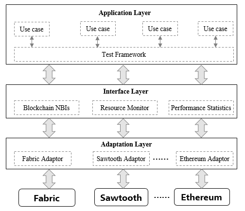
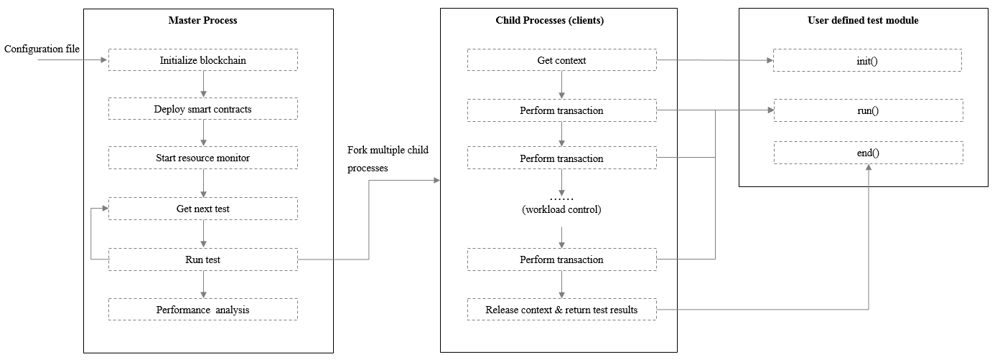

## Architecture


### Adaptation Layer

The adaptation layer is used to integrate existing blockchain system into Caliper framework. Each adaptor implements the 'Caliper Blockchain NBIs' by using corresponding blockchain's native SDK or RESTful API. Hyperledger Fabric1.0 and Sawtooth are current supported now, while Ethereum and other blockchain systems are in the plan.     

### Interface Layer

The interface layer provides north bound interfaces for up-applications. Three kinds of NBIs are provided:
* Blockchain operating interfaces, which contains operations to deploy smart contracts on backend blockchain, invoking contracts, querying states from the ledger, etc.
* Resource monitoring interfaces, which contains operations to start/stop a monitor and fetch resource consumption status of backend blockchain system, including CPU, memory, network IO, etc. Now only a simple monitor for local docker containers is implemented. Other kinds of monitors will be implemented later.
* Performance measuring interfaces, which contains operations to read predefined performance statistics, including TPS, delay, success ratio, etc. Key metrics are recorded while invoking blockchain NBIs, e.g created time and committed time of the transaction, result of the transaction, etc. Those metrics are used later to generate the statistics.
   
### Application Layer

The application layer contains some tests implemented for typical blockchain scenarios. Each test has a configuration file to define the backend blockchain network and test arguments. Those tests can be used directly to test the performance of the blockchain system.

A default test framework is implemented to help developers to implement their own test quickly. How to use the test framework is explained in the latter part. Of course, developers can use NBIs directly to implement their test without the framework.


## Test Framework




### Configuration File
 
Below is a configuration file example:
```json
{
  "blockchain": {
    "type": "fabric",
    "config": "./fabric.json"
  },
  "test": {
    "clients": 5,
    "rounds": [{
        "cmd" : "open",
        "txNumbAndTps" : [[5000,100], [5000,200], [5000,300]],
        "arguments": {  "money": 10000 },
        "callback" : "benchmark/simple/open.js"
      },
      {
        "cmd" : "open",
        "txNumbAndTps" : [[5000,400]],
        "arguments": {  "money": 10000 },
        "callback" : "benchmark/simple/open.js",
        "out" : "accounts"
      },
      {
        "cmd" : "query",
        "txNumbAndTps" : [[5000,300], [5000,400]],
        "arguments": {  "accounts":  "*#out" },
        "callback" : "benchmark/simple/query.js"
      }]
  },
  "monitor": {
    "type": "docker",
    "docker":{
      "name": ["all"]
    },
    "interval": 1
  }
}
```
* **blockchain** - defines the type of backend blockchain system and the configuration file for the adaptor to prepare the test environment and interact with the backend blockchain system.
* **test** - defines the number of simulated clients to run the tests concurrently, as well as multiple test rounds, in each test round:
  * **cmd** : command for test
  * **txNumbAndTps** : defines a array of sub-rounds with different transaction numbers or transaction generating speed. For example, [5000,400] means totally 5000 transactions will be generated and invoked with a speed of 400 transactions per second. In above example, actually six (not three) test rounds are defined.
  * **arguments** : user defined arguments which will be passed directly to the user defined test module. A reserved key string "*#out" is used to declare an argument with output of previous test round(see the explanation of *out* argument).
  * **callback** : specifies the user defined module used in this test round
  * **out** : name of the output of this test rounds, if exists, the output of the user defined module will be cached for later use. If multiple sub-rounds are defined, those outputs will be concatenated as a single output.   
* **monitor** - defines the type of resource monitor and monitored objects, as well as the time interval for the monitoring.
  * docker : a docker monitor is used to monitoring local docker containers. Name of the containers can be specified. Reserved 'all' means all active containers will be watched.  
  * others : to be implemented.
### Master Process

The default test flow contains three stages. The first is 'preparing' stage, in this stage, the application create and initialize a blockchain object with the configuration file, deploy smart contracts as specified in the configuration and start a monitor object to monitoring resource consumption of backend blockchain system.

The second stage is 'testing' stage. The application start a loop to do the test according to the *test* argument. In each test round, multiple child processes are forked to perform the task. Testing results from each child process are recorded for later use.
    
The final stage is 'finishing' stage. Performance statistics is generated in this stage.

### Child Process

Nodejs is single-threaded by nature. The default test framework uses cluster to do the actual testing tasks to improve throughput on multi-core machines. The total workload will be divided and assigned equally to child processes. A child process acts as a blockchain client with a temporarily generated context to interact with the backend blockchain system. The context usually contains the client's identity and cryptographic materials, and will be released after all the testing tasks are finished.
  
The actual testing task should be implemented in independent modules with specific functions exported. The child process imports such modules to perform actual transactions asynchronously.
 
### User defined test module

Three functions should be implemented and exported, all those functions should return a Promise object.

* init - Will be called by the child process at the beginning of the tests with a given blockchain object and context, as well as user defined arguments read from configuration file. The blockchain object and context should be saved for later use, and other initialization step could be implemented in here.
* run -  The actual transactions should be generated and invoked in here. The child process will call this funcion repeatedly according to assigned workload, so it is recommended that only one transacion is generated in this funcion for fine-grained workload control, but of course this is not a MUST limitation. The implementation process should be asynchronous.
* end - Will be called  by the child process when all the tests are finished, any clearing work should be implemented in here. And as explained before, new child processes will be forked in each test round, so it's impossible to use local variables in the testing module to save data across different test rounds. This function also gives a way to return any data that should be cached for later use. Of course developers could implement their own caching mechanism by using database or file systems, etc.    


